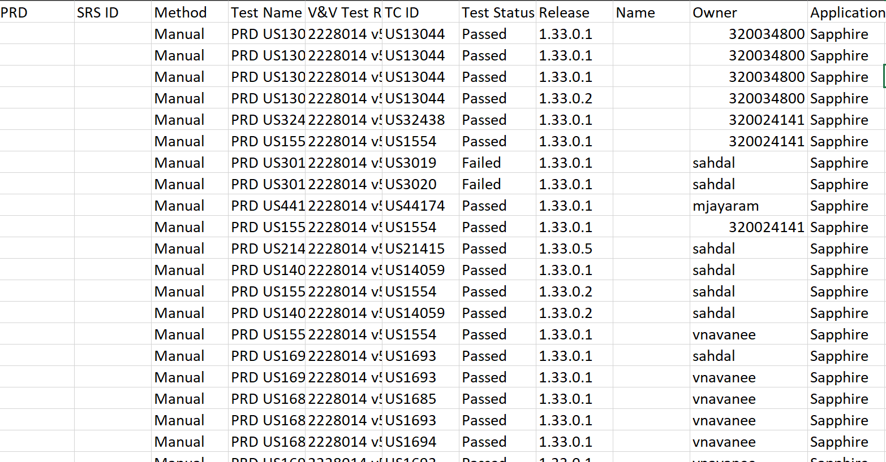

# CMU Capstone Project: Trace Matrix Utility
This capstone project was created in partnership with Philips. We were allowed to make this code visible as part of our professional portfolios, as part of the contract signed for all capstone projects.

Team members:
* Bryan Denny
* Pooja Puvvadi
* Yuhan Liu
* Jacob Lee

## Description

Philips manages and reports information about hundreds of thousands of product safety tests, as per regulatory requirement. This is largely done by hand, which can be a difficult and consuming process.

This utility receives Excel, Word, and text documents containing information about product tests and regulatory requirements, scrapes the test information, then outputs a dataset containing the formatted data. It also runs tests to ensure that the outputted data is of appropriate quality, and tries to detect any errors/inconsistencies.

The utility will take in the following inputs:
* SRS
* PRD
* Use Case Document
* Automation As-Runs
* Manual As-Runs
* List of Historical SRS
* List of Active PRD
* Previous Trace Matrix
* Release Number

The utility will then **process these files and output a new trace matrix** based on these files. In addition, the utility will **validate** the new trace matrix based on these checks:
* Manual tests are pass or fail
* Automated tests are pass or fail
* All PRD must have at least one SRS
* All SRS must have at least one test
* All SRS must have at least one PRD
* All PRD items referenced by SRS must exist (not obsolete) 
* All SRS referenced by tests must exist (not obsolete)
* All PRD referenced by tests must exist (not obsolete)

After the validation step, the utility will output an **error log** in a csv file with the rows that have been invalidated by the checks.


## Scripts
All scripts are in the `src` folder.
* `create_trace.py`
  * contains functions for processing test documents in order to create the new trace
* `read_write.py`
  * contains functions for reading in input files
* `run.py`
  * Contains main pipeline code and also parsing command line inputs.
* `select_file.py`
  * User interface
* `validate_trace.py`
  * Validating the new trace matrix

We've also provided examples of outputs from the current version of the script: `sample_output.csv` and `sample_error_log.csv`.

## Pipeline Description
`run.py/run()` is the main pipeline method.

On a high level it runs four main steps:
1. Read/parse data
2. Combine into trace matrix
3. Validate
4. Output

In more detail:
1. The method receives arguments (file paths, etc) from either UI (``select_file.py``) or command line (parsed in `run.py/main()`).
2. The method calls `create_trace.py/create_trace()`, which reads each dataset/document to a `pandas.DataFrame` (`read_write.py`) and processes it.
3. During this process, errors/invalid data are also gathered.
4. The DataFrame for each document is concatenated into a single DataFrame, which is the new trace matrix. This new trace and the list of invalid data DataFrames is then returned back to `run.py/main()`.
5. Validation. Trace is passed to `validate_trace.py/validate_trace()`, where it goes through each test and is returned, along with any invalid entries that were filtered out
6. Exporting trace and error log (`read_write.py/write_error_log()`) to `.csv`. 

## Installation
1. Download this folder using the green button labeled `Code` on the top right of the page. Unzip if needed.
2. Install [Anaconda](https://www.anaconda.com/products/individual) that has version >= 3.7 of Python . 
3. Now we need to install two small libraries in order to read Excel and Word files.

In command line, (search `cmd.exe` in Windows, `bash` in Linux, or `terminal` in Mac), `cd` to this folder and run this command to automatically install the libraries:

```
pip install -r requirements.txt
```

Alternatively, you can run these commands without needing to navigate to the folder:

```
pip install python-docx
pip install openpyxl
```
You're done!

## How to Run Script

You can run this using either UI or command line.

**UI (Currently Windows only):**
1. Double click `start.exe` in this folder
2. Click select buttons to select corresponding files/folders
3. Input the version number in the pattern of #.#.#
4. Select srs prefix from the dropdown list
5. Click start button to start processing

**Command line (Works on all platforms):**
1. In your console, `cd` into this folder.
2. You can either modify the command in `run.sh` then simply call `./run.sh` to execute it, or modify and directly run this command yourself in console:
```
python src/run.py -o "desired_trace_name.csv" -m "path/to/ER2228014 v51 ATT1 Manual As-Runs.docx" -s "data/Obsolete SRS_Test Cases_11.16 pull.csv" -p "data/1.33 PRD.xlsx" -a "data/ER2228014 v51 ATT2 Automated as-run" -v "1.33.0"
```

## Remaining/Incomplete Tasks

* Writing logic for these missing columns. 



We commented out validation for now, otherwise it'd always fail. Should reenable validation once columns are all complete and logic is verified.

* Ensure all relevant documents are included in the pipeline
    * Currently, only manual as-run and automatic tests are fully integrated.
    * We've written code in `read_write.py` to read in most other documents provided, however. But they still would need to be parsed in `create_trace.py`.
* Adding in backfilling of entries
* Verifying that current logic and process is correct
    * Particularly while formatting data in `create_trace.py`. 
* Writing more validation tests in `validate_trace.py`.
* Improving UI/integration with Rally/Sapphire.
